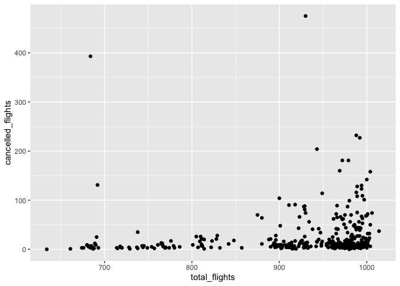
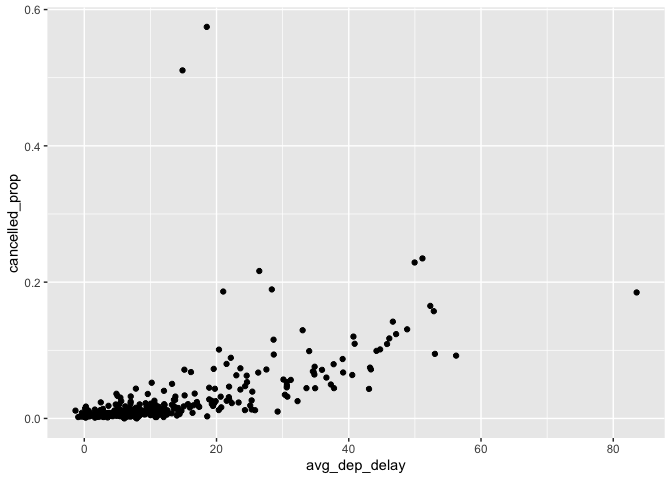

HW-1
================
Ruhani Arora
2022-09-28

``` r
library(dplyr)
```

    ## 
    ## Attaching package: 'dplyr'

    ## The following objects are masked from 'package:stats':
    ## 
    ##     filter, lag

    ## The following objects are masked from 'package:base':
    ## 
    ##     intersect, setdiff, setequal, union

``` r
library(nycflights13)
```

1.How many flights have a missing dep_time? What other variables are
missing? What might these rows represent?

``` r
flights %>% 
  filter(is.na(dep_time))
```

    ## # A tibble: 8,255 × 19
    ##     year month   day dep_time sched_dep_time dep_delay arr_time sched_arr_time
    ##    <int> <int> <int>    <int>          <int>     <dbl>    <int>          <int>
    ##  1  2013     1     1       NA           1630        NA       NA           1815
    ##  2  2013     1     1       NA           1935        NA       NA           2240
    ##  3  2013     1     1       NA           1500        NA       NA           1825
    ##  4  2013     1     1       NA            600        NA       NA            901
    ##  5  2013     1     2       NA           1540        NA       NA           1747
    ##  6  2013     1     2       NA           1620        NA       NA           1746
    ##  7  2013     1     2       NA           1355        NA       NA           1459
    ##  8  2013     1     2       NA           1420        NA       NA           1644
    ##  9  2013     1     2       NA           1321        NA       NA           1536
    ## 10  2013     1     2       NA           1545        NA       NA           1910
    ## # … with 8,245 more rows, and 11 more variables: arr_delay <dbl>,
    ## #   carrier <chr>, flight <int>, tailnum <chr>, origin <chr>, dest <chr>,
    ## #   air_time <dbl>, distance <dbl>, hour <dbl>, minute <dbl>, time_hour <dttm>

The other missing variables are dep_delay, arr_time, arr_delay and
air_time. These rows might represent that the flight was canceled which
is why these variables are missing.

2.Currently dep_time and sched_dep_time are convenient to look at, but
hard to compute with because they’re not really continuous numbers.
Convert them to a more convenient representation of number of minutes
since midnight.

``` r
flights %>% 
  mutate(
    dep_time_mins= (dep_time%/% 100 * 60) + dep_time %% 100,
    sched_dep_time_mins = (sched_dep_time%/% 100 * 60) + sched_dep_time %% 100
    )
```

    ## # A tibble: 336,776 × 21
    ##     year month   day dep_time sched_dep_time dep_delay arr_time sched_arr_time
    ##    <int> <int> <int>    <int>          <int>     <dbl>    <int>          <int>
    ##  1  2013     1     1      517            515         2      830            819
    ##  2  2013     1     1      533            529         4      850            830
    ##  3  2013     1     1      542            540         2      923            850
    ##  4  2013     1     1      544            545        -1     1004           1022
    ##  5  2013     1     1      554            600        -6      812            837
    ##  6  2013     1     1      554            558        -4      740            728
    ##  7  2013     1     1      555            600        -5      913            854
    ##  8  2013     1     1      557            600        -3      709            723
    ##  9  2013     1     1      557            600        -3      838            846
    ## 10  2013     1     1      558            600        -2      753            745
    ## # … with 336,766 more rows, and 13 more variables: arr_delay <dbl>,
    ## #   carrier <chr>, flight <int>, tailnum <chr>, origin <chr>, dest <chr>,
    ## #   air_time <dbl>, distance <dbl>, hour <dbl>, minute <dbl>, time_hour <dttm>,
    ## #   dep_time_mins <dbl>, sched_dep_time_mins <dbl>

3.Look at the number of canceled flights per day. Is there a pattern? Is
the proportion of canceled flights related to the average delay? Use
multiple dyplr operations, all on one line, concluding with
ggplot(aes(x= ,y=)) + geom_point()

``` r
library(ggplot2)
cancelled_flights_per_day <- flights %>%
  mutate(cancelled_flight = (is.na(dep_delay) | is.na(arr_delay))) %>%
  group_by(year,month,day) %>%
  summarise(
    cancelled_flights = sum(cancelled_flight),
    total_flights = n(),
  ) 
```

    ## `summarise()` has grouped output by 'year', 'month'. You can override using the
    ## `.groups` argument.

``` r
ggplot(cancelled_flights_per_day)+
  geom_point(aes(x=total_flights,y=cancelled_flights))
```

<!-- -->

After looking at the graph, there seems to be a pattern between the days
having more number of flights to have a higher number of cancelled
flights.

``` r
prop <- flights %>%
  mutate(cancelled_flight = (is.na(dep_delay) | is.na(arr_delay))) %>%
  group_by(year,month,day) %>%
  summarise(
    cancelled_prop = mean(cancelled_flight),
    avg_dep_delay = mean(dep_delay, na.rm = TRUE)
  ) %>%
  ungroup()
```

    ## `summarise()` has grouped output by 'year', 'month'. You can override using the
    ## `.groups` argument.

``` r
ggplot(prop) +
  geom_point(aes(x = avg_dep_delay, y = cancelled_prop))
```

<!-- -->

The proportion of canceled flights related to the average dep delay as
if there is a longer delay in departure time the flight is more likely
to get canceled. However, there are a few outliers in this graph where
the avg dep delay is not high but the cancellation prop is is highest.
